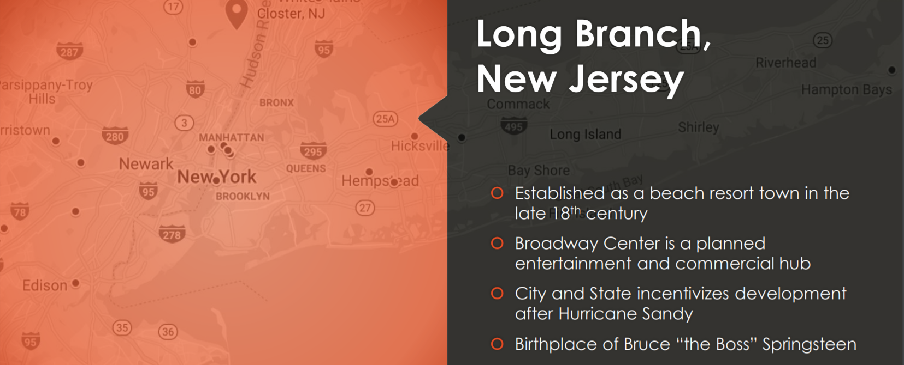

# UBS Pitch Competition

## Prompt

UBS is always looking for more innovative ways to connect with and provide value to our clients and prospects. In pursuit of this goal, we are looking to apply Machine Learning in how we identify new locations for branch offices. For this competition, you are tasked with using Machine Learning to identify the next 3 locations where UBS should open a Wealth Management branch. As part of this, you are required to come up with a solution that is completely automated and can be repeated upon request.

## Problem Approach

Since UBS data only include locations of existing branch, I decided to use several unsupervised clustering algorithms to find the common denominators among the existing UBS locations and apply these to measure the similarity between a new location and the existing locations. This can be viewed as the classic outlier detection where the training data only consists of one type and the model has to recognize the different instance. Here, I'm only interested in the similiar instances and the similarity score is measured by the average Euclidean distance score.

## Data Source

1. `UBS Branches.csv` contains the City, State, and Zipcode of all current UBS Wealth Management branch
2. [Individual Income Tax Statistics - ZIP Code Data (SOI) from the IRS](https://www.irs.gov/statistics/soi-tax-stats-individual-income-tax-statistics-zip-code-data-soi) in 2012 and 2016

## Model Features

## Model Selection

## Result

## Repo Structure

`UBS.ipynb` is the main notebook containing all the work. `UBS_demo.ipynb` was used for demo day (cleaned version of the main notebook). `UBS_adjust_weight.ipynb` is used to show how sensitive the models are when adjusting for the weight of features. `UBS_remove_6_features.ipynb` is used to show what would happen if some features are excluded. These demonstrate the different scenarios when using the ML models.

    ├── README.md
    ├── UBS Pitch Challenge.pdf
    ├── data
    │   └── UBS Branches.csv
    └── models
        ├── UBS.ipynb
        ├── UBS_adjust_weight.ipynb
        ├── UBS_demo.ipynb
        └── UBS_remove_6_features.ipynb
            